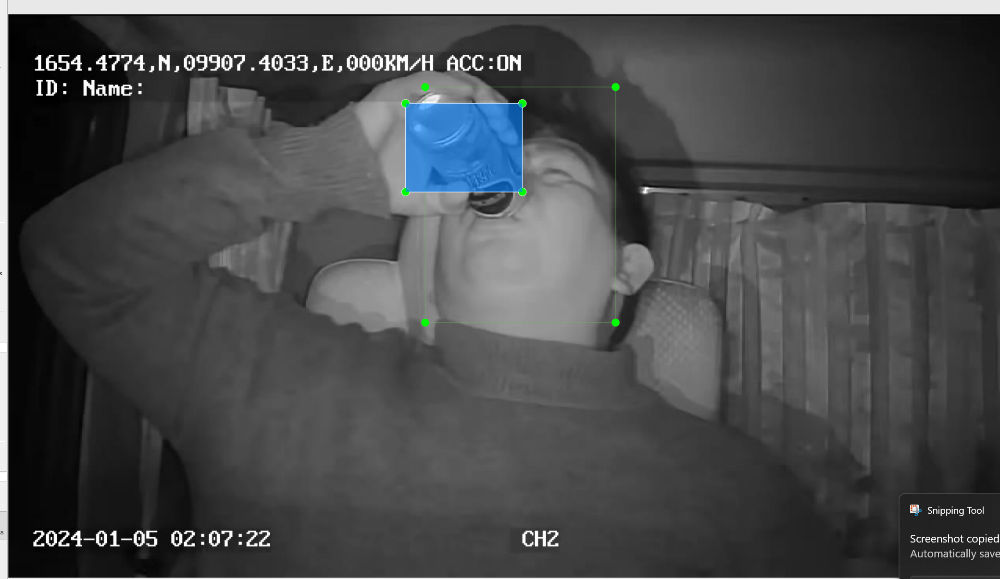
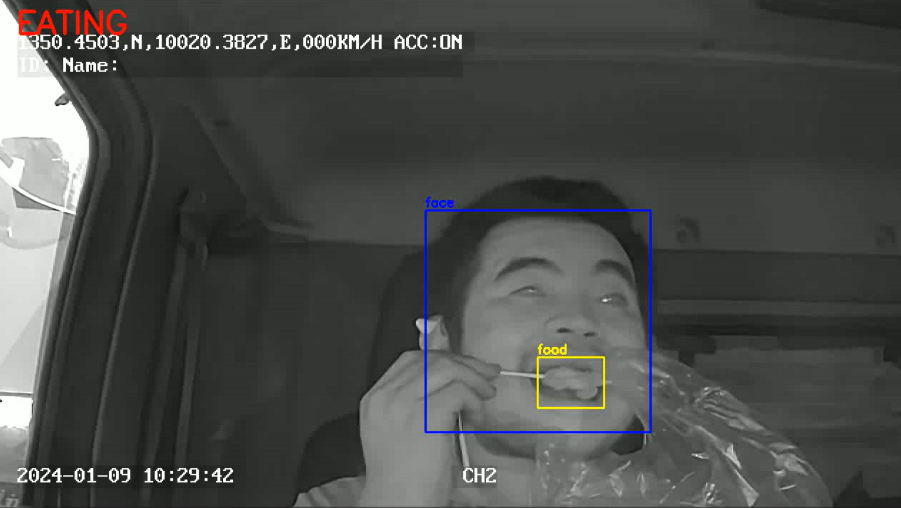

# CONII-TTT-Tesa-Edge-AI-Eatfood-Detection

Eatfood Detection


## Version
0.1.0

### Features
* Detect the driver's head.
* Detect any food
* Conditions
  * Finding Head in image -> Good
  * Finding food in image -> Bad
  * If finding head and food more than 5 second -> Bad/Alert

### Supported kits (make variable 'TARGET')

- [PSOC&trade; Edge E84 Evaluation Kit](https://www.infineon.com/KIT_PSE84_EVAL) (`KIT_PSE84_EVAL_EPC2`) – Default value of `TARGET` (tested)
- [PSOC&trade; Edge E84 Evaluation Kit](https://www.infineon.com/KIT_PSE84_EVAL) (`KIT_PSE84_EVAL_EPC4`)
- [PSOC&trade; Edge E84 AI Kit](https://www.infineon.com/KIT_PSE84_AI) (`KIT_PSE84_AI`)


#### Tools
* [ModusToolbox](https://www.infineon.com/design-resources/development-tools/sdk/modustoolbox-software?uid=ci44510001&aid=ai4451&gclsrc=aw.ds&gad_source=1&gad_campaignid=21544549833&gbraid=0AAAAADpmf9eCeVKpUbj7qFToHJWQoXqjv&gclid=CjwKCAiAkbbMBhB2EiwANbxtbUcjLVxQyMXbMPO-9CEml5x8BNMwZ_sYdUzpfT8vvO2c3bHPpmn71RoCUbsQAvD_BwE)
* [DEEPCRAFT Studio](https://developer.imagimob.com/deepcraft-studio/install-download-studio)
* [Tera Term](https://teratermproject.github.io/index-en.html)


###### Change logs
* Version 0.0.1
  * detect head only
  * verify head method with confidence 0.7
* Version 0.0.2
  * detect head
  * detect food
  * verify both head and food method with confidence 0.7
* Version 0.1.0
  * Training and Testing model -> successful
  * build and deploy to a board -> unsuccessful






###### Author
* Development
``` Sukonthee Sungkhun - Techical Director```
* Maintenance
``` Sukonthee Sungkhun - Techical Director```

